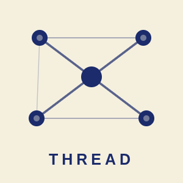

<div align="center">
  <picture>
    <source media="(prefers-color-scheme: dark)" srcset="src/icons/icon300.png">
    
  </picture>

  <br>

  <a href="#"></a>
  <a href="#"></a>
  <a href="#"></a>
  <a href="#"></a>

  <br>

  <p><strong>Universal, stateful context migration between any LLMs</strong></p>

  <p>
    <a href="#-overview"></a>
    <a href="#-overview">Documentation</a>
    ·
    <a href="#-usage"></a>
    <a href="#-usage">Demo</a>
  </p>
</div>

<br>

> Thread is a local-first Manifest V3 browser extension that seamlessly migrates conversation context between AI models. Extract chat history from any LLM, compress it into a structured property graph via a native C++ WASM engine, and inject it into your next session — no servers, no data leaks, no context loss.

<br>

---

## Overview

Switching between LLMs should not mean losing your chain of thought. Thread treats your conversation as a structured graph — code blocks, key terms, links, and turn order — and safely carries that structure from one platform to another.

The entire pipeline runs locally inside your browser. A heuristic DOM scanner extracts chat data, a C++ WebAssembly engine compresses it into a property graph, and the popup renders an interactive visualization before injection.

<br>

---

## Features

<table>
  <tr>
    <td width="50">
      
    </td>
    <td><strong>Cross-Platform Migration</strong><br>Transfer context between ChatGPT, Claude, and Gemini with one click.</td>
  </tr>
  <tr>
    <td width="50">
      
    </td>
    <td><strong>Property Graph Compression</strong><br>Chat histories are compressed into a structured graph — code blocks, key terms, and links become typed nodes with relational edges.</td>
  </tr>
  <tr>
    <td width="50">
      
    </td>
    <td><strong>Interactive Graph Visualization</strong><br>Review exactly what context will be transferred via an interactive Cytoscape.js graph before migration.</td>
  </tr>
  <tr>
    <td width="50">
      
    </td>
    <td><strong>100% Local Processing</strong><br>All parsing happens in-browser via WebAssembly. Zero external API calls, zero data exfiltration.</td>
  </tr>
  <tr>
    <td width="50">
      
    </td>
    <td><strong>Heuristic DOM Extraction</strong><br>Platform-agnostic scanner adapts to UI changes without brittle CSS selectors. Supports ChatGPT, Claude, and Gemini out of the box.</td>
  </tr>
  <tr>
    <td width="50">
      
    </td>
    <td><strong>Clipboard Fallback</strong><br>Copy the beautified payload if auto-injection fails — always have a way out.</td>
  </tr>
</table>

<br>

---

## Demo

<div align="center">
  <table>
    <tr>
      <td align="center">
        <br>
        
        <br>
        <em>Extraction Preview</em>
        <br><br>
        <small><em>(Screenshot not yet available)</em></small>
        <br><br>
      </td>
      <td align="center">
        <br>
        
        <br>
        <em>Graph Visualization</em>
        <br><br>
        <small><em>(Screenshot not yet available)</em></small>
        <br><br>
      </td>
      <td align="center">
        <br>
        
        <br>
        <em>Migration Flow</em>
        <br><br>
        <small><em>(Demo video not yet available)</em></small>
        <br><br>
      </td>
    </tr>
  </table>
</div>

<br>

---

## Quick Start

### Prerequisites

- Node.js 18+
- npm 9+
- Emscripten SDK (for WASM compilation)

### Installation

```bash
# Clone the repository
git clone https://github.com/Arham-Qureshi/Thread.git
cd Thread

# Install dependencies
npm install

# Build the WASM engine and extension bundle
npm run build
```

### Load into Browser

1. Navigate to `chrome://extensions/`
2. Enable **Developer mode**
3. Click **Load unpacked** and select the `dist/` directory

<br>

---

## Usage

<div align="center">
  <table>
    <tr>
      <td align="center" width="33%">
        <br>
        
        <br>
        <strong>1 Extract</strong>
        <br><br>
        <small>Open a conversation on ChatGPT, Claude, or Gemini. Click the Thread icon, then <strong>Extract</strong>. The heuristic engine scans the DOM and builds your context graph.</small>
        <br><br>
      </td>
      <td align="center" width="33%">
        <br>
        
        <br>
        <strong>2 Review</strong>
        <br><br>
        <small>Inspect the extracted graph — nodes for code blocks, links, and key terms with their relational edges — before deciding where to send it.</small>
        <br><br>
      </td>
      <td align="center" width="33%">
        <br>
        
        <br>
        <strong>3 Inject</strong>
        <br><br>
        <small>Select a target platform. Thread opens a fresh chat, injects the compressed graph payload, and primes the model to inherit your full context.</small>
        <br><br>
      </td>
    </tr>
  </table>
</div>

<br>

---

## Architecture

```mermaid
graph LR
    A[Content Script] -->|DOM Scan| B[WASM Engine]
    B -->|GraphJSON| C[chrome.storage.local]
    C -->|State Read| D[Popup UI]
    D -->|Route Command| E[Background SW]
    E -->|Open Tab + Inject| F[Target LLM]
    F -->|Payload| G[New Session]

    style A fill:#1e2024,stroke:#4fd1c5,color:#f7fafc
    style B fill:#1e2024,stroke:#4fd1c5,color:#f7fafc
    style C fill:#1e2024,stroke:#4fd1c5,color:#f7fafc
    style D fill:#1e2024,stroke:#4fd1c5,color:#f7fafc
    style E fill:#1e2024,stroke:#4fd1c5,color:#f7fafc
    style F fill:#1e2024,stroke:#4fd1c5,color:#f7fafc
    style G fill:#1e2024,stroke:#4fd1c5,color:#f7fafc
```



<br>

### Project Structure

```
src/
├── background/
│   ├── background.js        # Service worker — message router, WASM orchestrator
│   └── wasm_loader.js       # Emscripten WASM module instantiation
├── content/
│   ├── generic_extractor.js  # Heuristic DOM scanner (platform-agnostic)
│   ├── generic_injector.js   # Universal input locator + paste synthesizer
│   └── shared_utils.js
├── popup/
│   ├── popup.html           # Extension popup layout
│   ├── popup.js             # UI logic, Cytoscape graph rendering
│   ├── popup.css            # Claymorphism design system (dark/light mode)
│   └── payload_formatter.js # JSON beautification + prompt wrapper
├── wasm_engine/
│   ├── GraphBuilder.cpp     # Property graph construction in C++
│   ├── ThreadParser.cpp     # Thread parser
│   ├── textrank.cpp/h       # Native TextRank keyword extraction
│   ├── stemmer.h            # Porter stemmer (header-only)
│   └── Makefile             # Emscripten build configuration
├── icons/                   # Extension icons (16, 48, 128, 300px)
```

<br>

---

## Technical Stack

<table>
  <tr>
    <td><strong>Frontend</strong></td>
    <td>Vanilla JavaScript (ES6+), HTML, CSS</td>
  </tr>
  <tr>
    <td><strong>Visualization</strong></td>
    <td>Cytoscape.js</td>
  </tr>
  <tr>
    <td><strong>Processing</strong></td>
    <td>C++17 compiled to WebAssembly via Emscripten</td>
  </tr>
  <tr>
    <td><strong>Backend</strong></td>
    <td>Chrome Extension Manifest V3 (Service Worker)</td>
  </tr>
  <tr>
    <td><strong>Storage</strong></td>
    <td><code>chrome.storage.local</code> — all state is local</td>
  </tr>
  <tr>
    <td><strong>Bundler</strong></td>
    <td>Webpack 5</td>
  </tr>
</table>

<br>

---

## API Reference

### Message Passing Protocol

| Action | Sender | Receiver | Payload |
|--------|--------|----------|---------|
| `EXTRACT_DOM` | Popup | Service Worker | — |
| `EXTRACT_COMPLETE` | Content Script | Service Worker | `{ role, content }[]` |
| `PROCESS_GRAPH` | Popup | Service Worker | `{ role, content }[]` |
| `routeInjection` | Popup | Service Worker | `{ target, payload }` |
| `THREAD_INJECT_PAYLOAD` | Service Worker | Content Script | `string` |

### WASM Exports

| Function | Input | Output |
|----------|-------|--------|
| `buildGraph(jsonInput)` | String (JSON array of messages) | String (JSON graph) |
| `processString(input)` | String | String |

<br>

---

## Contributing

Contributions are welcome. The project follows a standard fork-and-PR workflow.

1. Fork the repository
2. Create a feature branch: `git checkout -b feature/my-feature`
3. Commit your changes: `git commit -m 'Add my feature'`
4. Push: `git push origin feature/my-feature`
5. Open a Pull Request

Please ensure the WASM engine compiles cleanly (`npm run build:wasm`) and the full bundle passes (`npm run build`) before submitting.

<br>

---

## License

This project is licensed under the MIT License. See [LICENSE](LICENSE) for details.

<br>

---

<div align="center">
  <br>
  <p>
    
    <strong> Star </strong> if this project helps you move between models without losing context.
  </p>
  <br>
</div>
